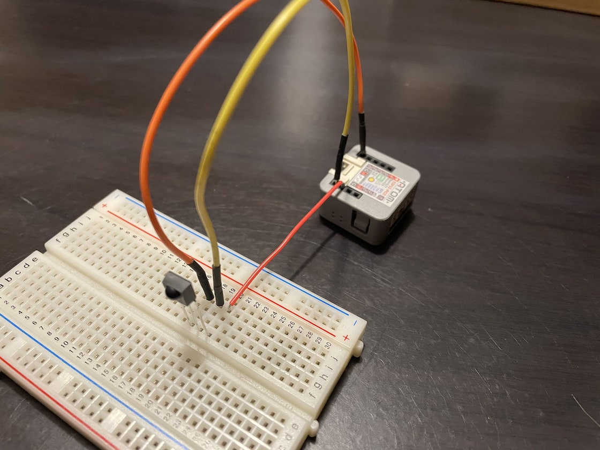

# receive-infrared-sample

# Usage

* Connect the infrared receiver module to pin 33 of the Atom Matrix
* Build with PlatformIO
* Upload to Atom Matrix
* Launch Platform IO serial monitor
* Irradiate the infrared receiver module with infrared rays

# Example of connecting Atom Matrix and infrared module

